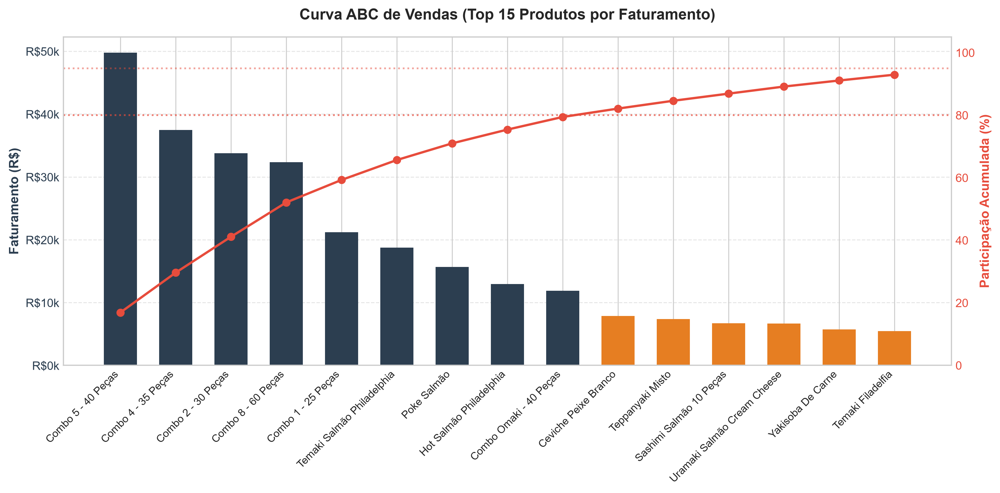

# Pipeline de Qualidade de Dados

Este repositório contém um pipeline ETL em Python (Pandas) desenvolvido para limpar, validar e auditar relatórios de vendas exportados de sistemas de PDV de restaurantes. 

O script original foi criado para substituir processos manuais em Excel e auditar divergências de faturamento em uma operação real de restaurante japonês (com faturamento de R$ 2,08 milhões em 29 meses). Os dados do cliente são protegidos e foram substituídos por um script gerador de dados sintéticos para demonstração.

## O Problema

Ao cruzar os relatórios fiscais com o fechamento do caixa físico, identificamos inconsistências causadas por duas falhas silenciosas na exportação do software de PDV:

1. **O Bug Decimal de 10x (Localização de Moeda)**
   O sistema exportava valores decimais de forma inconsistente: ora no padrão brasileiro (`128,90`), ora no padrão americano (`128.9`). Um parser ingênuo que simplesmente remove pontos para converter a string em float transforma `128.9` em `1289`, inflando o valor de venda da linha em 10 vezes. Isso passava despercebido nos relatórios agregados semanais.
2. **Incompatibilidade Quantidade vs Total**
   Devido a erros de sincronização de cupons ou descontos mal rateados no PDV, o valor na coluna `Valor Total` não correspondia a `Quantidade × Valor Unitário`.

## A Solução (ETL)

O script `etl_consumer_pdv.py` automatiza o tratamento:
*   **Decisão Decimal (`_parse_monetario`):** Lógica condicional que analisa a frequência de pontos e vírgulas em cada linha para determinar o separador decimal correct.
*   **Reconciliação (`verificar_integridade_faturamento`):** Recalcula `Qtd × Unitário` e corrige automaticamente o valor total divergente, reportando as linhas afetadas no terminal.
*   **Categorização:** Classifica cada item vendido por meio de regras regex em categorias consolidadas (Combo, Temaki, Sashimi, Bebidas) para análises gerenciais.

## Gráfico da Curva ABC
Para apoiar a análise de vendas, o script `plotar_curva_abc.py` processa as saídas do ETL e plota a Curva ABC de faturamento acumulado (Pareto):



## Como rodar o projeto

1. Instale as dependências:
   ```bash
   pip install -r requirements.txt
   ```
2. Gere a base de dados de teste (com os erros de decimal embutidos):
   ```bash
   python gerar_dados_exemplo.py
   ```
3. Execute o pipeline:
   ```bash
   python etl_consumer_pdv.py
   ```
4. Gere o gráfico de Pareto:
   ```bash
   python plotar_curva_abc.py
   ```

Os resultados serão salvos como `saida_financeiro.xlsx`, `saida_operacional.xlsx` e `imagens/curva_abc.png`.
